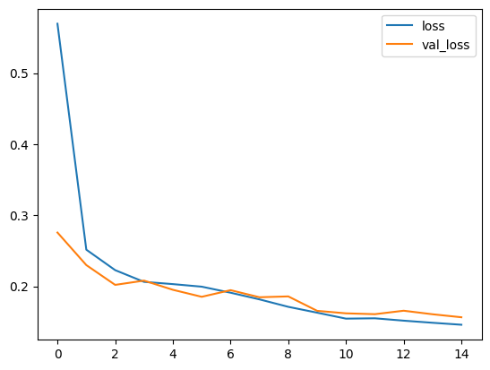
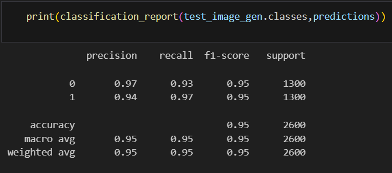
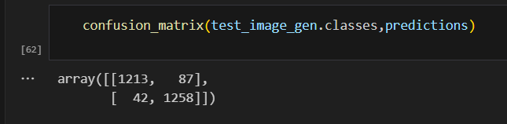
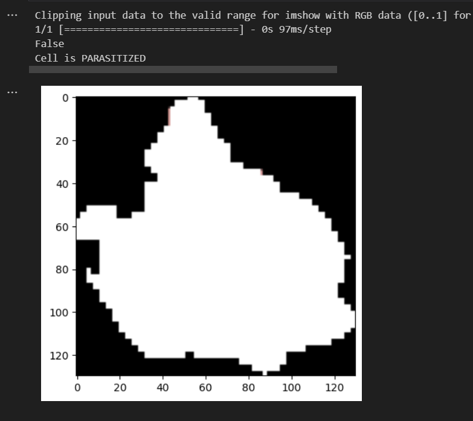

# EXP NO: 04

#  Deep Neural Network for Malaria Infected Cell Recognition
## AIM
To develop a deep neural network for Malaria infected cell recognition and to analyze the performance.
## Problem Statement and Dataset
Malaria dataset of 27,558 cell images with an equal number of parasitized and uninfected cells. A level-set based algorithm was applied to detect and segment the red blood cells. The images were collected and annotated by medical professionals.Here we build a convolutional neural network model that is able to classify the cells.


## Neural Network Model


## DESIGN STEPS

### STEP-1:
Import tensorflow and preprocessing libraries
### STEP 2:
Download and load the dataset folder
### STEP-3:
Split the  training and testing folders.
### STEP 4:
Perform image data generation methods.
### STEP-6:
Build the convolutional neural network model
### STEP-7:
Train the model with the training data
### STEP-8:
Plot the performance plot
### STEP-9:
Evaluate the model with the testing data using probability prediction(uninfected-> prob>0.5,parasitized-> <=0.5)
### STEP-10:
Fit the model and predict the sample input.

## PROGRAM
```py
# Name : Kavinraja D 
# RegNo:212222240047
import os
import pandas as pd
import numpy as np
import seaborn as sns
import matplotlib.pyplot as plt
from matplotlib.image import imread
from tensorflow.keras.preprocessing.image import ImageDataGenerator
from tensorflow import keras
from tensorflow.keras import layers
from tensorflow.keras import utils
from tensorflow.keras import models
from sklearn.metrics import classification_report,confusion_matrix
import tensorflow as tf


# to share the GPU resources for multiple sessions
from tensorflow.compat.v1.keras.backend import set_session
config = tf.compat.v1.ConfigProto()
config.gpu_options.allow_growth = True # dynamically grow the memory used on the GPU
config.log_device_placement = True # to log device placement (on which device the operation ran)
sess = tf.compat.v1.Session(config=config)
set_session(sess)
%matplotlib inline


my_data_dir = 'dataset/cell_images'
os.listdir(my_data_dir)
test_path = my_data_dir+'/test/'
train_path = my_data_dir+'/train/'
os.listdir(train_path)
len(os.listdir(train_path+'/uninfected/'))
len(os.listdir(train_path+'/parasitized/'))
os.listdir(train_path+'/parasitized')[0]
para_img= imread(train_path+
                 '/parasitized/'+
                 os.listdir(train_path+'/parasitized')[0])
para_img.shape 
plt.imshow(para_img)
# Checking the image dimensions
dim1 = []
dim2 = []
for image_filename in os.listdir(test_path+'/uninfected'):
    img = imread(test_path+'/uninfected'+'/'+image_filename)
    d1,d2,colors = img.shape
    dim1.append(d1)
    dim2.append(d2)
sns.jointplot(x=dim1,y=dim2)
image_shape = (130,130,3)
image_gen = ImageDataGenerator(rotation_range=20, 
                               width_shift_range=0.10,
                               height_shift_range=0.10, 
                               rescale=1/255, 
                               shear_range=0.1,
                               zoom_range=0.1, 
                               horizontal_flip=True, 
                               fill_mode='nearest' )
image_gen.flow_from_directory(train_path)
image_gen.flow_from_directory(test_path)


model = models.Sequential()
model.add(layers.Input(shape=(130,130,3))) 
model.add(layers.Conv2D(filters=32,kernel_size=(3,3),padding="same",activation='relu'))
model.add(layers.AvgPool2D(pool_size=(2,2)))
model.add(layers.Conv2D(filters=32,kernel_size=(3,3),padding="same",activation='relu'))
model.add(layers.MaxPool2D(pool_size=(2,2)))
model.add(layers.Flatten())
model.add(layers.Dense(32,activation='relu')) 
model.add(layers.Dense(1, activation ='sigmoid'))
model.summary()
model.compile(optimizer='Adam',
              loss='binary_crossentropy',
              metrics=['accuracy'])
model.summary()


train_image_gen = image_gen.flow_from_directory(train_path,
                                               target_size=image_shape[:2],
                                                color_mode='rgb',
                                               batch_size=16,
                                               class_mode='binary')
train_image_gen.batch_size
len(train_image_gen.classes)
train_image_gen.total_batches_seen
test_image_gen = image_gen.flow_from_directory(test_path,
                                               target_size=image_shape[:2],
                                               color_mode='rgb',
                                               batch_size=batch_size,
                                               class_mode='binary', shuffle = False)
train_image_gen.class_indices
results = model.fit(train_image_gen,epochs=5,validation_data=test_image_gen)
model.save('cell_model.h5')
losses = pd.DataFrame(model.history.history)
losses.plot()
model.evaluate(test_image_gen)
pred_probabilities = model.predict(test_image_gen)
test_image_gen.classe
predictions = pred_probabilities > 0.5
print(classification_report(test_image_gen.classes,predictions))
confusion_matrix(test_image_gen.classes,predictions)
from tensorflow.keras.preprocessing import image
img = image.load_img('mui.png')
img=tf.convert_to_tensor(np.asarray(img))
img=tf.image.resize(img,(130,130))
img=img.numpy()
type(img)
plt.imshow(img)
x_single_prediction = bool(model.predict(img.reshape(1,130,130,3))>0.6)
print(x_single_prediction)
if(x_single_prediction==1):
    print("Cell is UNINFECTED")
else:
    print("Cell is PARASITIZED")

```
## OUTPUT
### Training Loss, Validation Loss Vs Iteration Plot


### Classification Report 


### Confusion Matrix



### New Sample Data Prediction



## RESULT
 Thus, a deep neural network for Malaria infected cell recognition is developed and  the performance is analyzed.
